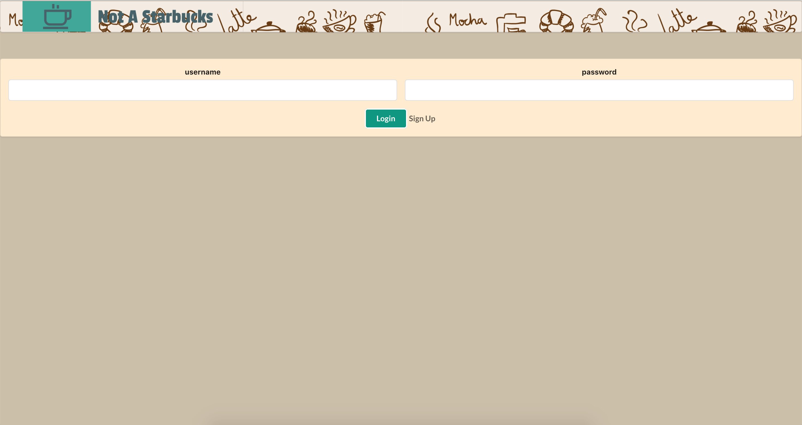
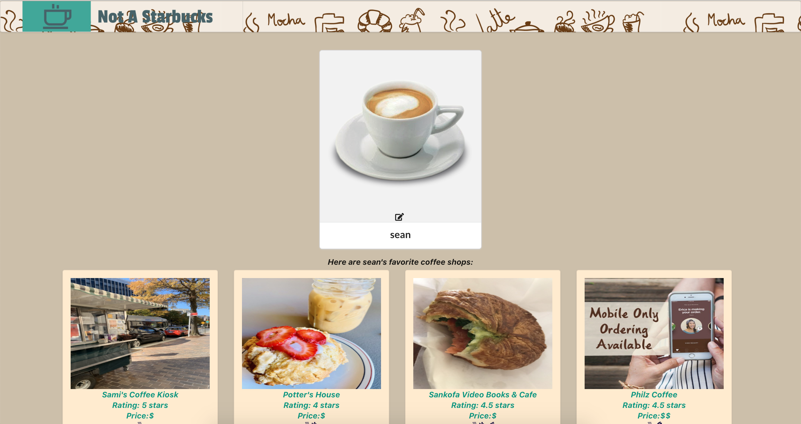
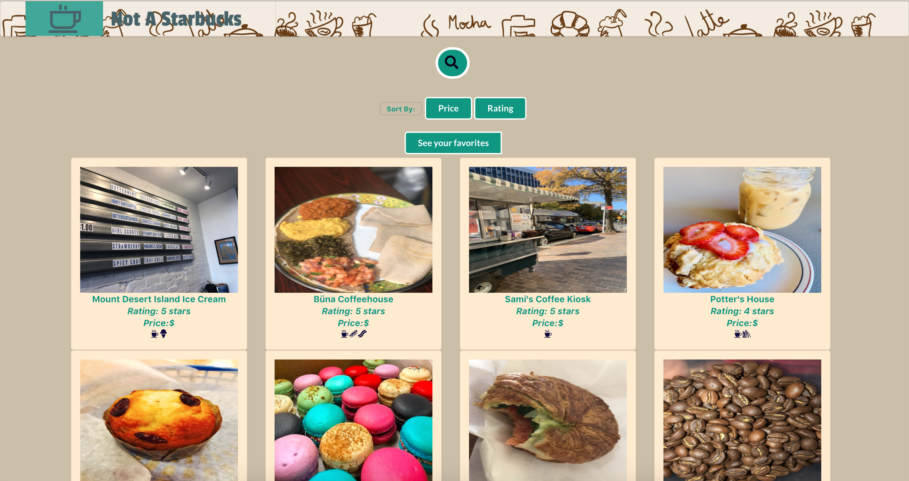
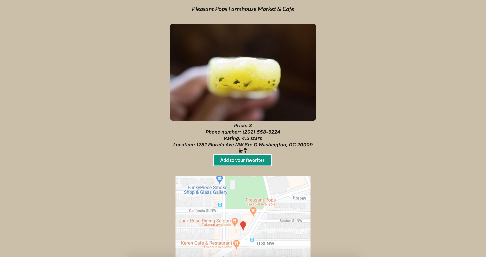

# Not A Starbucks
Welcome to the Not A Starbucks, an app to search and favorite local DC coffee shops that are not a big national chain.

Available features:
- **Users can sign up, log in, and save a profile picture**
- **Users can search for local coffee shops and sort by rating and prices**
- **Users can favorite coffee shops**

## Installation

- Fork and clone this repo and [the backend repo](https://github.com/seanb113/notAStarbucks_backend)

- First cd into the notAStarbucks_backend directory in the backend repo
  - Run `$ rails db:migrate`
  - Run `$ rails db:seed`
  - Run `$ rails s -p 4000`
- After the backend is up, cd into the NotAStarbucks_frontend directory in the frontend repo
  - Run `$ npm install`
  - Run `$ npm start`

## Screenshots of App Experience

#### Login Screen
 

#### Profile Screen

#### All Coffee Shop Search and Sort Sreen
 

#### Coffee Shop Information Screen
 

## Frameworks and Libraries Used

- Front-end: React.js
- Back-end: [Ruby on Rails](https://github.com/rails/rails)
- [Semantic-UI](https://semantic-ui.com/)

## Author
- Sean Beach (https://github.com/seanb113)
- Maria Stojanovic (https://github.com/marijastojanovic5)

## Contributing
Bug reports and pull requests are welcome on GitHub at https://github.com/seanb113/NotAStarbucks_frontend/issues. This project is intended to be a safe, welcoming space for collaboration, and contributors are expected to adhere to the [Contributor Covenant](http://contributor-covenant.org) code of conduct.

## License

The code is available as open source under the terms of the [MIT License](https://opensource.org/licenses/MIT).
