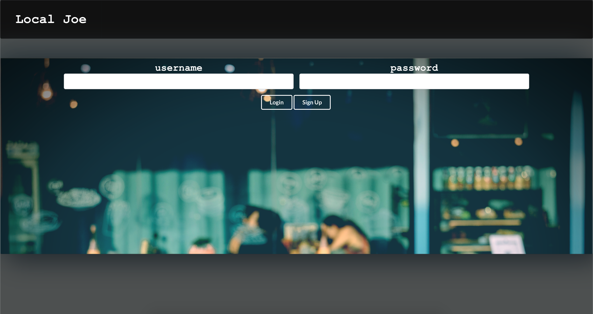
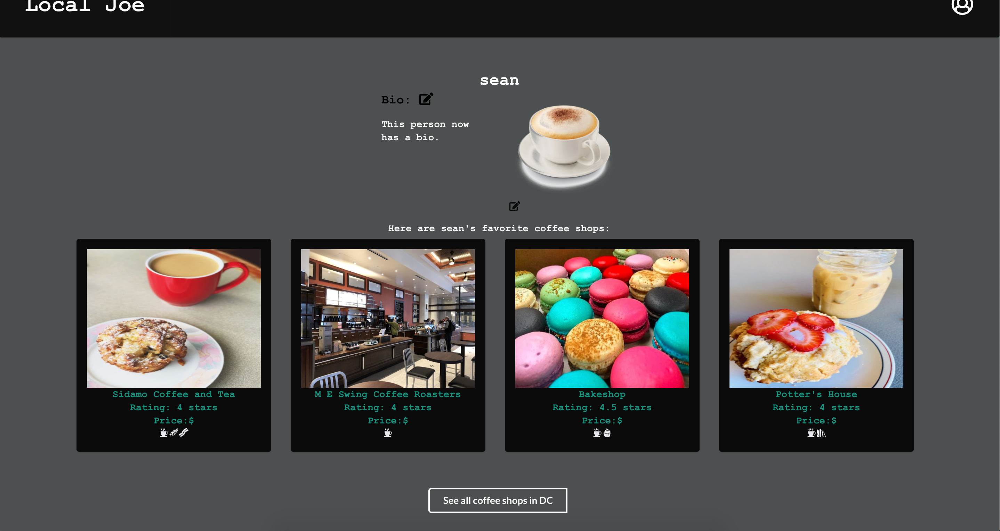
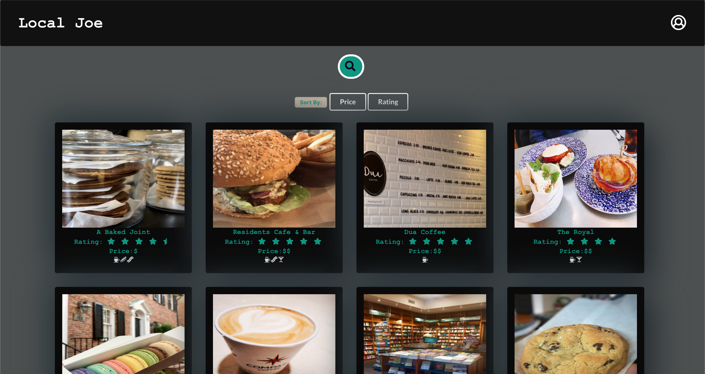
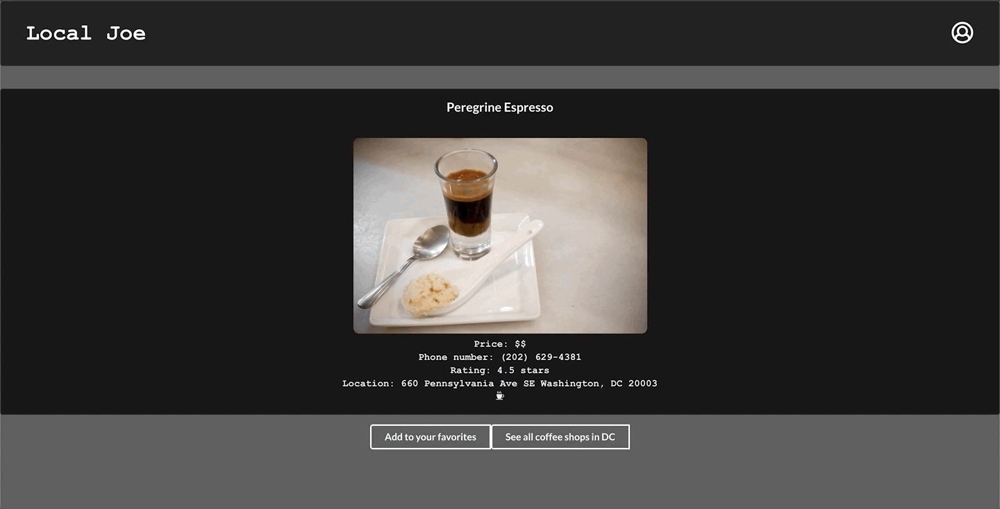

# Local Joe
Welcome to the Local Joe app, an app to search and favorite local DC coffee shops. Visit the backend repo [here](https://github.com/seanb113/LocalJoe_backend).

## Screenshots of App Experience

#### Login Screen
 

#### Profile Screen

#### All Coffee Shop Search and Sort Sreen
 

#### Coffee Shop Information Screen
 

## Frameworks and Libraries Used

- Front-end: React.js
- Back-end: [Ruby on Rails](https://github.com/rails/rails)
- [Semantic-UI](https://semantic-ui.com/)

## Author
- Sean Beach (https://github.com/seanb113)
- Maria Stojanovic (https://github.com/marijastojanovic5)
